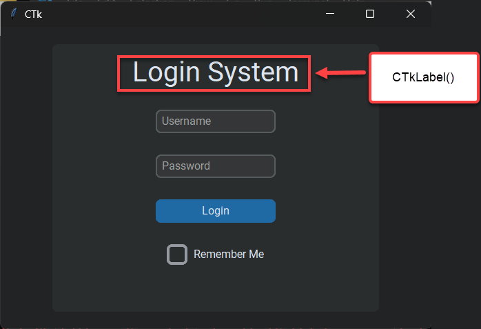

# customtkinter day 1

## Simple interface for a login system

<center></center>

---

### Youtube Video

[Modern Graphical User Interfaces in Python - NeuralNine (12m)](https://www.youtube.com/watch?v=iM3kjbbKHQU)

## Steps to Build a simple login system

1. Initialize a virtual environment
   ```sh
   python3 -m venv venv
   ```
1. Download Dependencies

   ```bash
   pip install customtkinter
   ```

1. create `main.py` file and import customtkinter
   ```py
   import customtkinter
   ```
1. set up interface general configs (e.g. theme, mode)
   ```py
   customtkinter.set_appearance_mode("dark") ## Modes: System, dark, light
   customtkinter.set_default_color_theme("blue") ## Themes: blue, green, dark-blue
   ```
1. Create the `root` Element
   ```py
   root = customtkinter.CTk() ## create CTk window
   root.geometry("500x350")
   ```
1. Create a `frame` element, that contains all the interface elements

   ```py
   frame = customtkinter.CTkFrame(master=root)
   frame.pack(pady=20, padx=60, fill="both", expand=True) ## You can also Use: frame.grid()
   ```

   <small style="color: #777">

   - Each Component needs a master. So when calling the CTk\<component>() constructor, The first argument is always the master.

   - the `frame` is going to be the master for most components
     </small>

1. Add a label (title) for your application
   ```py
   label = customtkinter.CTkLabel(master=frame, text="Login System", text_font=("Roboto", 24))
   label.pack(pady=12, padx=10)
   ```
   <center></center>
1. Add 2 Entries for username and password
   ```py
   entry1 = customtkinter.CTkEntry(master=frame, placeholder_text="Username")
   entry1.pack(pady=12, padx=10)
   entry2 = customtkinter.CTkEntry(master=frame, placeholder_text="Password", show="*")
   entry2.pack(pady=12, padx=10)
   ```
   <center></center>
1. add a button
   ```py
   button = customtkinter.CTkButton(master=frame, text="Login", command=login)
   button.pack(pady=12, padx=10)
   ```
   <center></center>
1. add a check box
   ```py
   checkbox = customtkinter.CTkCheckBox(master=frame, text="Remember Me")
   checkbox.pack(pady=12, padx=10)
   ```
   <center></center>
1. Run the the main loop of the application
   ```py
   root.mainloop()
   ```

## Documentations and more

- [github](https://github.com/TomSchimansky/CustomTkinter)
- [documentaion (pypi)](https://pypi.org/project/customtkinter/0.3/)

## CTK Elements

|     CTkButton      |   CTkLabel   |   CTkEntry    |
| :----------------: | :----------: | :-----------: |
| **CTkProgressBar** | **CTkFrame** | **CTkSlider** |

**More On their arguments in the [documentation]((https://pypi.org/project/customtkinter/0.3/))**

| arguments | value                                                              |
| --------- | ------------------------------------------------------------------ |
| master    | root, tkinter.Frame or CTkFrame                                    |
| width     | width in px                                                        |
| height    | height in px                                                       |
| fg_color  | forground color, tuple: (light_color, dark_color) or single color  |
| bg_color  | background color, tuple: (light_color, dark_color) or single color |
